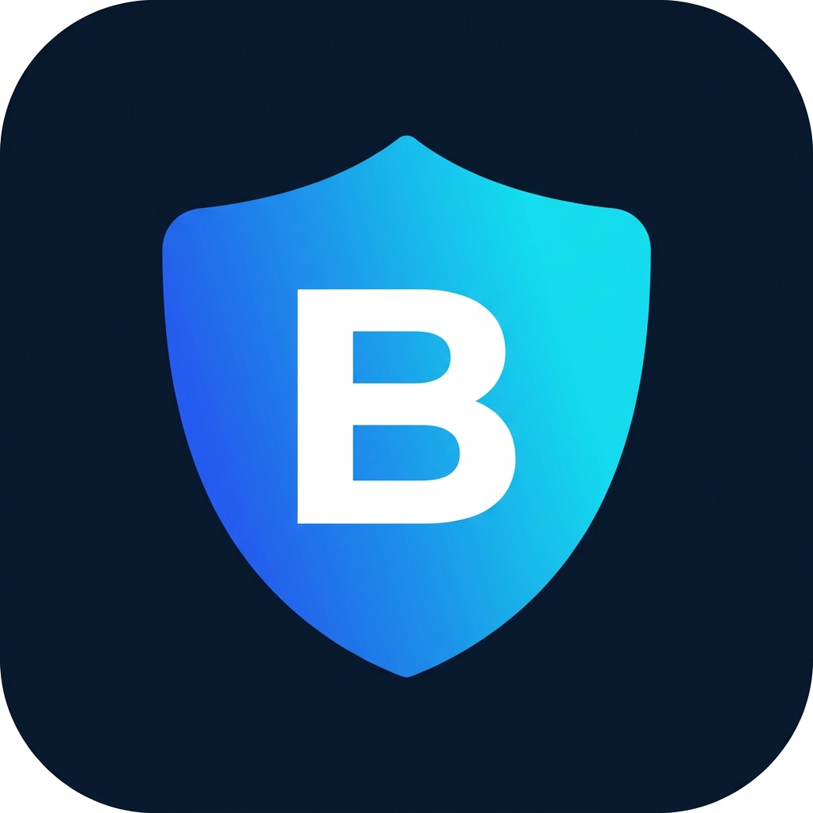

# BRAVE AI — Anti-Bullying CCTV Monitoring Dashboard



**BRAVE AI** adalah website dashboard + PWA untuk monitoring CCTV dan deteksi bullying berbasis AI di lingkungan sekolah. Aplikasi ini berfungsi sebagai antarmuka monitoring yang menerima data dari sistem AI detection yang dikembangkan secara terpisah.

> ⚠️ **Catatan Penting:** AI model, dataset, training, dan proses deteksi bullying dikerjakan oleh tim lain. Project ini fokus pada **frontend web dan PWA** saja.

---

## Tech Stack

| Category | Technology |
|----------|-----------|
| Framework | Next.js 16 (App Router) |
| Language | TypeScript |
| Styling | Tailwind CSS v4 + shadcn/ui |
| State Management | Zustand |
| Data Fetching | TanStack Query (siap digunakan) |
| Forms | React Hook Form + Zod |
| Charts | Recharts |
| Animation | Framer Motion |
| Icons | Lucide React |
| Video | hls.js (placeholder) |
| Date | date-fns |
| PWA | Manual configuration |

---

## Fitur

- 🏠 **Dashboard** — Statistik kamera, alert, dan grafik insiden mingguan
- 📹 **Live View** — Grid kamera CCTV dengan status real-time dan simulasi alert bullying
- 💾 **Recordings** — Daftar rekaman dengan filter, timeline bar, dan tombol evidence clip
- 📋 **Bullying Log** — Tabel insiden bullying dengan filter kamera & severity, detail dialog
- ⚙️ **Settings** — Profil, preferensi notifikasi, informasi aplikasi
- 🔐 **Login** — Halaman login dengan form validation
- 📱 **PWA** — Installable di mobile, responsive, bottom navigation
- 🔔 **Alert System** — Notifikasi real-time (simulasi) saat bullying terdeteksi

---

## Struktur Folder

```
brave-ai-cctv/
├── src/
│   ├── app/                    # Next.js App Router pages
│   │   ├── layout.tsx          # Root layout + PWA metadata
│   │   ├── page.tsx            # Redirect ke login
│   │   ├── login/              # Halaman login
│   │   ├── dashboard/          # Dashboard utama
│   │   ├── live-view/          # Live view kamera
│   │   ├── recording-view/     # Rekaman video
│   │   ├── bullying-log/       # Log insiden bullying
│   │   └── settings/           # Pengaturan
│   ├── components/
│   │   ├── layout/             # Sidebar, Topbar, MobileNav, AppShell
│   │   └── ui/                 # shadcn/ui components
│   └── lib/
│       ├── api/                # API client abstraction (mock data)
│       ├── mocks/              # Dummy data
│       ├── types/              # TypeScript interfaces
│       ├── stores/             # Zustand stores
│       └── utils.ts            # Utility functions
├── public/
│   ├── manifest.json           # PWA manifest
│   ├── icons/                  # PWA icons
│   └── images/                 # Placeholder images
├── .env.example                # Environment variables template
└── package.json
```

---

## Instalasi & Menjalankan

### Prerequisites

- Node.js 18+ dan npm

### 1. Clone & Install

```bash
git clone <repository-url>
cd brave-ai-cctv/frontend
npm install
```

### 2. Setup Environment

```bash
cp .env.example .env.local
```

### 3. Jalankan Development Server

```bash
npm run dev
```

Buka [http://localhost:3000](http://localhost:3000) di browser.

### 4. Login

Gunakan email **`admin@braveai.school`** dengan password **`password`** setelah backend dimigrasikan dan seed user demo dijalankan.

---

## Environment Variables

```env
NEXT_PUBLIC_APP_NAME=BRAVE AI
NEXT_PUBLIC_API_BASE_URL=http://localhost:8000/api
NEXT_PUBLIC_WS_URL=ws://localhost:8000/ws
NEXT_PUBLIC_MEDIA_BASE_URL=http://localhost:8000/media
```

---

## Status & Roadmap

### ✅ Selesai (Tahap 1 — Frontend Foundation)
- [x] Project setup & dependency installation
- [x] Dark theme dashboard UI
- [x] Responsive layout (desktop + mobile PWA)
- [x] Semua halaman utama (Login, Dashboard, Live View, Recordings, Log, Settings)
- [x] Mock data & API client abstraction
- [x] Zustand stores (auth, alert, camera)
- [x] PWA configuration (manifest, icons)
- [x] Form validation (login)
- [x] Chart (Recharts)
- [x] Animasi UI (Framer Motion)

### 🔲 Akan Dikembangkan (Tahap Selanjutnya)
- [ ] Integrasi dengan backend API (FastAPI)
- [ ] Integrasi dengan AI detection service (dari tim AI)
- [ ] WebSocket real-time alerts dari backend
- [ ] HLS video streaming (koneksi ke MediaMTX/RTSP)
- [ ] Autentikasi JWT
- [ ] Evidence clip (FFmpeg)
- [ ] Role-based access control
- [ ] Push notifications
- [ ] Laporan dan export data

---

## Catatan untuk Tim

- **Tim AI**: Data dari model deteksi bullying akan diterima melalui API endpoint yang sudah disiapkan di `lib/api/`. Saat ini menggunakan mock data. Format data yang diharapkan ada di `lib/types/`.
- **Tim Backend**: API client di `lib/api/client.ts` sudah dikonfigurasi dengan `NEXT_PUBLIC_API_BASE_URL`. Tinggal ganti implementasi mock di setiap modul API.
- **Semua data saat ini adalah dummy/mock** dan akan digantikan dengan data real dari backend + AI service.

---

## License

Private — Internal Project
